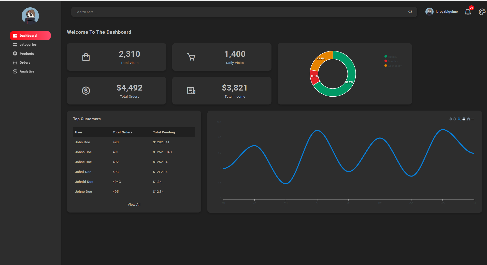
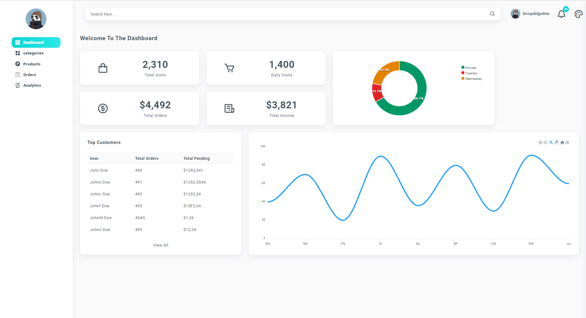

# React Admin Dashboard with Multiple Themes

    Build React Admin Dashboard with 2 Themes and colors.

# Description

    I Built React Admin Dashboard with ReactJS, CSS, Redux


# Preview




## Deploy on your computer
You need to have `nodejs` and `git` installed on your pc for following the intructions

First download the repository using
```
git clone https://github.com/leroyabiguime/dashboard-integration.git
```

After you download this repository to your computer. Next, to download the dependencies run
```
npm install
```

Now build and start the production build of the site using
```
npm run start
```

This will start the app on http://127.0.0.1:3000
or 
This will start the app on http://localhost:3000

# Now Enjour :=)

# Contact
Leroy Abiguime- [Twitter](https://www.twitter.com/leeroyAb) - mataa.abiguime17@gmail.com 


